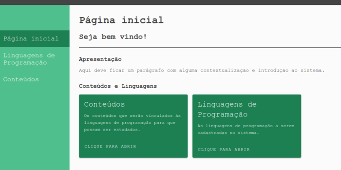
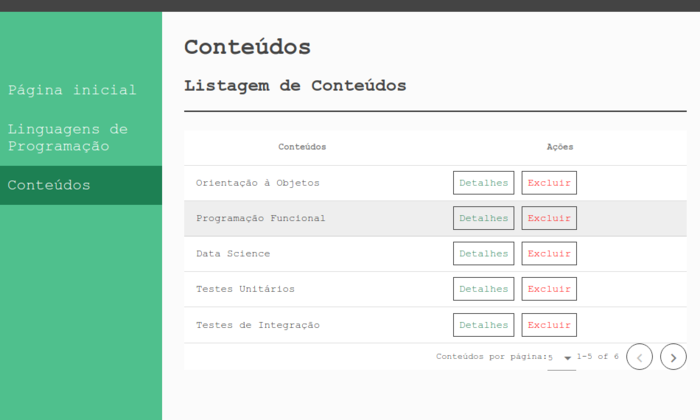

# Language Content - Frontend

Obs: o exagero de verde é uma referência ao VueJs....

## Objetivo

Praticar VueJs.

## Funcionalidades

Esse projeto se destina a ter as seguintes funcionalidades: 

- cadastro de linguagens e conteúdos
- vincular conteúdos às linguagens
- acompanhar o status do aprendizado dos conteúdos vinculados a uma linguagem

## Framework

VueJs.
